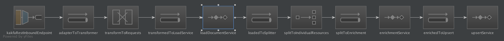

dp-publish-pipeline-enrich-search
================
#Digital Publishing Document Enrichment
This microservice reads the resource location from an message on a Kafka topic, it then loads the resource and any 'downloadable' files, extracts the text from the contents and then updates the existing index entry.

Currently all invocations are via kafka, but a REST api could easily be added using the http end point and adding at webserver to the boot configuration.

##Kafka messages requests
By default this micro-service listens to a single kafka topic `dp.enrichment` and then uses the wrapping object to determine the next step.

 
###Enrich a single resources
Currently we are using a simple 'non-wrapped' 
```
{
  "collectionId": "abc",
  "fileLocation": "file://Test/file/location",
  "s3Location": "s3://ons-web-data/2016-03-11/site/businessindustryandtrade/retailindustry/bulletins/retailsales/january2016/f3548b32.json"
}
```

##Running
To run the application locally run the `./run.sh` in the root directory, this will initiates a Maven&trade; clean rebuild (`mvn clean install`).
The Kafka consumer is listening to a inbound topic of `dp.enrichment` 

### Configuration 
Configuration is all located in a single Yaml file [application.yml](src/main/resources/application.yml)

##Design

This enrichment micro-service is a [Spring Integration&trade;](https://projects.spring.io/spring-integration/) hosting on a (non-web) [Spring Boot&trade;](http://projects.spring.io/spring-boot/) container.

###Spring integration&trade;
 Spring Integration&trade; was used to separate the implementation of the business logic from the technical and structure wiring of the application.
 For example the business services should not be aware of the message transport layter (or threading model or transaction model) that is being implemented.
 
 The business service layer should only be concerned with the impelmentation of the business logic, this `Separation Of Concerns` is aided by the use of the Spring Integration&trade;
    framework, as the definition of the protocols, transformations and threadpools are defined as part of the framework and not inside any business service.
     
 Thus the current implementation can concentrate on the implementation (and testing) of the services: 
 
 * _DocumentLoaderService_<br/> 
    Loads the page data from the file location whether local, S3 or http
 * _EnrichmentService_<br/>
    Loads the download content and decodes the documents, attaching the ascii text to the index-able document
 * _UpsertService_<br/>
    Updates the record in elastic, if the record doesn't exist we can create an empty record with just the downloads and pageData elements (_we may want to change this_)  

The current integration flow is


but this could easily be amended to include other inbound and outbound endpoints, primarily by only be including new configuration.


###Spring Boot&trade;
We are using Spring Boot&trade; with out a Webservice as this creates an easy to manage deployment artifact with
 (we have experienced classloader issues with uber-jar/jar-with-dependencies, that we have not with Spring Boots specialise classloader).

Currently we are building an executable jar file that can be executed directly, the AWS Keys are requirement to be exposed as variable 
    

## Appendix
###Polymorphic Messaging via Json Wrapper Objects
The following may be removed when current Pipeline prockafkaInboundEndpoint.png
                                                       loadCredentials.sh
                                                       multiInboundEndpoint.png
                                                       pom.xml
                                                       run.shess has been confirmed
But the Jackson configuration is set up to accept different messages over the same inbound topic, but use a Json wrapping
 object, that Jackson can use to enable polymorphic messaging over the same inbound topic; i.e if required at a later date
 the inbound requests could be deleteRequest, indexCollectionRequest, etc... have a look at [Request.java](./src/main/java/com/github/index/enrichment/model/Request.java) 
Currently the `Request` _interface_ is not configured in the but if it was it would build the correct request instance based on the message supplied.
(*NB* you would also need to use the [SubTypeMapper](./src/main/java/com/github/onsdigital/index/enrichment/model/transformer/SubTypeMapper.java) to register all the subtypes of `Request` with the `ObjectMapper`)

Spring Integration would then invoke the correct method on the [DocumentLoaderService](./src/main/java/com/github/onsdigital/index/enrichment/model/transformer/SubTypeMapper) based on the type of Request

> If you where to implement more polymorphic solutions then it would make sense to replace the direct invocation of the service object from 
> Sprint Integration&trade; with a _facade_ which could then delegate to the correct service.
> You could then implement, for example, a `DatabaseService`, `ElasticSearchService` and a `S3Service` all fronted be a `DocumentLoaderFacade`
>

#### Below are example of message that were available prior to the Pipeline interface definition.
_The following comment and the associated code should be removed
To enrich an explicitly defined  resources from the repository you can request an individual resources to be enriched.
```
{
  "EnrichDocumentsRequest": {
    "resources": [
      {
        "id": "/economy/investmentspensionsandtrusts/datasets/ownershipofukshares/2014",
        "index": "ons",
        "type": "dataset"
      }
    ]
  }
}
```

###Enrich a whole index
To enrich a whole index then send an `EnrichAllDocumentsRequest` on the same kafka topic `dp.enrichment` and all the resources with in the index will be enriched
```
{
  "EnrichAllDocumentsRequest": {
    "index": "ons"
  }
}
```
By supplying this request the whole "ons" index is loaded and the downloads directory loaded from the localhost file system.
Once the file system is moved to the S3 file system we will need to revisit this

###Enrich a single resource
If the location of the underlying `data.json` file is known (i.e. local file:/classpath:/http:/s3:) then the file can be supplied with the full path for it to be loaded and enriched
```
{
  "EnrichResourceDocumentsRequest": {
    "resources": [
      {
        "dataFileLocation": "s3://ons-web-data/publishing/2017-01-23/master/aboutus/careers/benefits/data.json"
      }
    ]
  }
}
```
 
### Contributing

See [CONTRIBUTING](CONTRIBUTING.md) for details.

### License

Copyright © 2016-2017, Office for National Statistics (https://www.ons.gov.uk)

Released under MIT license, see [LICENSE](LICENSE.md) for details.
