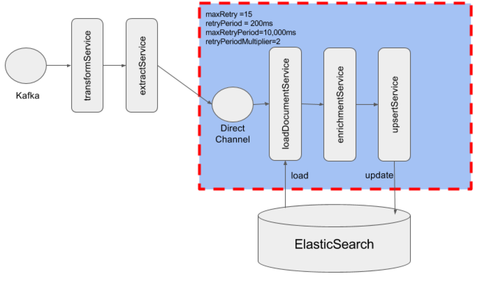
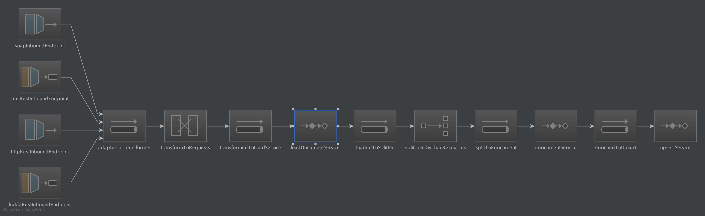

dp-publish-pipeline-enrich-search
================
#Digital Publishing Document Enrichment
This microservice reads the resource location or content from an message on a Kafka topic, it then converts either the file based 
 resource or message content on the request in to plain text. The original document is then loaded from ElasticSearch and the content is added (enriched) and the document save.
 
If the load from Elastic Search fails or is the Update document fails then the load-enrich-save process will be retried for 15 attempts finally it will fail with an error message in the logs.
If any requests are inflight during a failure then the requests will be retained on the kafka and resumed when the server restarts (i.e. the messages are not acknowledged until after they are processed).
This does mean that there is a possibility of a messages/request being process twice, due to the idempotent nature of this service and ElasticSearch&trade; this will result in the same outcome as if the message was only processed once.
 
This is a multithreaded consumer of the kafka queues and this micro-service may have multiple instances running, as each 
request contains a single resource/content for a single ElasticSearch document/Web-page, it is possible that two requests 
to update the same document with different content. To remove the possibility of loosing data this concurrent race condition 
is resolved through optimistic locking of the page; if between reading and saving the document the page has changed then 
the processe will be reload, re-enrich, re-save .


 
Currently all invocations are via kafka, but a REST api could easily be added using the http end point and adding at webserver to the boot configuration.

##Kafka messages requests
By default this micro-service listens to a single kafka topic `dp.enrichment` and then uses properties object to determine the next step.
 
###Enrich a single resources
Currently we are using a single 'non-wrapped' json request that has two purposes;
* enrich an existing page based on  the contents of a filebased resource
* enrich an existing page based on content of the message.

Enrich existing page based on the content of the message is received as:
```
{
  "fileContent" : "json:fileContent",
  "filelocation" : "/blah/blah/blah/XXXXX.json"
}
``` 

Enrich existing based on a filebase resource is received as:
```
{
  "s3Location" : "s3://s3Loc",
  "filelocation" : "/blah/blah/blah/"
}
```


Although this is not ideal, this multi-purposed messages is limited to  Kafka and Transformation service, the 
TransformationService emits a `UpdatePageDataPayload` or a `UpdateResourcePayload` to clearly signal the purpose of each
 request and enable polymorphic services to provide different actions based on the payload


##Running
To run the application locally run the `./run.sh` in the root directory, this will initiates a Maven&trade; clean rebuild (`mvn clean install`).
The Kafka consumer is listening to a inbound topic of `dp.enrichment` 

`run.sh` expects you to have a '~/.aws/configuration/credentials' file that contains the following variables if you wish to 
connect to S3 for the file resources
```properties
[default]
aws_access_key_id = X2C£FS$FNOTAREALKEY	
aws_secret_access_key = khj123j8sfdjk12Not4AR34lK3y
```
If you do not have this configuration then you can set the environment variables manually before running.
```bash
export S3_SECRET_ACCESS_KEY=X2C£FS$FNOTAREALKEY
export S3_ACCESS_KEY=khj123j8sfdjk12NotARealKey
```


### Configuration 
Configuration is all located in a single Yaml file [application.yml](src/main/resources/application.yml)
To override the default configuration you can pass the configuration values in to JVM `-D` arguments as dot notation for example;
For example:
 
```
elasticsearch:
    inet-addresses:
          -
            host: 127.0.0.1
```

becomes dot.notation as

 ```
 -Delasticsearch.inetAddresses[0].host=127.0.0.1
 ``` 
Therefore it is possible to override the following settings;

| dot.notation | Description | Default ''
| `cloud.aws.region.static` | The AWS region | eu-west-1 |
| `kafka.zookeeper.connect` | The connection details for the ZooKeeper that manages the Kafka instance we are connecting to | `localhost:9092` |
| `kafka.zookeeper.connect` | The connection details for the ZooKeeper that manages the Kafka instance we are connecting to | `localhost:9092` |
| `kafka.topic` | The topic to listen on for messages | `dp.enrichment` |
| `kafka.consumers` | The number of threads to process messages | `4` |
| `elasticsearch.inetAddresses[0].host` | The first name of the ElasticSearch host (or IP Address) | `localhost` |
| `elasticsearch.inetAddresses[0].port` | The first name of the ElasticSearch port | `9300` |
| `elasticsearch.inetAddresses[1].host` | The second name of the ElasticSearch host (or IP Address) | |
| `elasticsearch.inetAddresses[1].port` | The second name of the ElasticSearch port |  |
 


##Design

This enrichment micro-service is a [Spring Integration&trade;](https://projects.spring.io/spring-integration/) hosted in a (non-web) [Spring Boot&trade;](http://projects.spring.io/spring-boot/) container.

###Spring integration&trade;
 Spring Integration&trade; was used to separate the implementation of the business logic from the technical and structural wiring of the application.
 i.e.the business services should not be aware of the message transport layer (or threading model or transaction model or retry model) that is being implemented.
 
 The business service layer should only be concerned with the implementation of the business logic, this `Separation Of Concerns` 
 is aided by the use of the Spring Integration&trade; framework, as the definition of the protocols, transformations and 
 threadpools are defined as part of the framework and not inside any business service.
     
 Thus the current implementation can concentrate on the implementation (and testing) of the services: 
 * _TransformationSerivce_</br>
    Translates the inbound single Json into request specific payload objects
 * _ExtractContentService_</br>
    Converts the PageData or loads and converts the Downloadable content. The output contains the data in a clear text format
 * _DocumentLoaderService_<br/> 
    Loads the page page from the Elastic Search
 * _EnrichmentService_<br/>
    Added the 'Data' to the appropriate location on the Page
 * _UpsertService_<br/>
    Updates the record in elastic, if the record doesn't exist or if it has changed since loading an exception is thrown and the flow reverts back to the _DocumentLoaderService_  

The current integration flow is above but this could easily be amended to include other inbound and outbound endpoints, primarily by only be including new configuration.

>These are only examples, and are not the current flow (See above for the current flow)

###Spring Boot&trade;
We are using Spring Boot&trade; without a Webserver as this creates an easy to manage deployment artifact within a single
self-executable jar file.
(We have experienced classloader issues with uber-jar/jar-with-dependencies, that we have not with Spring Boots specialized classloader).

Currently we are building an executable jar file that can be executed directly, the AWS Keys are required to be exposed
 as environment variables 
    

## Appendix
###Polymorphic Messaging via Json Wrapper Objects

Jackson Json parser configuration can be set up to accept different messages over the same inbound topic, by using a Json wrapping
 object. It is relatively simple to add WRAPPED_OBJECT annotation to a common Request ancestor and if Jackson is registered with all decedents (see Google Reflections) it 
 can be correctly instantiate the correct request instance and thereby enablespolymorphic messaging over the same inbound topic; 
 
Spring Integration would then invoke the correct method on the _Services+_ based on the type of Request, rather than having logic in the TransformationService 
to determien the type

> If you where to implement more polymorphic solutions then it would make sense to replace the direct invocation of the service object from 
> Sprint Integration&trade; with a _facade_ which could then delegate to the correct service.
> You could then implement, for example, a `DatabaseService`, `ElasticSearchService` and a `S3Service` all fronted be a `DocumentLoaderFacade`
>

 
### Contributing

See [CONTRIBUTING](CONTRIBUTING.md) for details.

### License

Copyright © 2016-2017, Office for National Statistics (https://www.ons.gov.uk)

Released under MIT license, see [LICENSE](LICENSE.md) for details.
